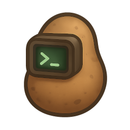

# 🥔 TATERS: Takes All Things, Extracts Relevant Stuff

  
  <video src="img/taters-animation.mp4" autoplay loop muted playsinline
         width="548"
         style="flex:1 1 340px; max-width:548px; height:auto; border-radius:6px;"
         aria-label="Taters running a pipeline, from picking a source through to the finished report">
    <a href="img/taters-animation.mp4">Watch Taters run a pipeline</a>
  </video>

---

Available on [GitHub](https://github.com/ryanboyd/taters) and [PyPI](https://pypi.org/project/taters/).

> Status: **early and evolving**. It already works for many common workflows,
> but expect the occasional rough edge and renaming as things mature. Pin a
> version if you need stability.

---

## The backstory

Today, there are more ways to think about language as data than ever before
in human history. The rapid expansion of text analytics and natural language
processing into the social sciences has been great for us "word nerds" with
programming backgrounds, but not so great for curious scholars and students
who are lacking in technical expertise. For many people who want a simple way
to get up and running, the idea of learning a new programming language,
figuring out entire ecosystems of package dependencies, and trying to get
things to "just work" can be daunting. Even for those of us who do this for a
living, it can be frustrating at times.

Some years ago, I tried to solve this problem with a program called BUTTER —
a free text analysis application where you could build your own pipelines
without writing a single line of code. The idea was simple: there are a lot
of methods that social scientists commonly need, so why not put them all in
one place? BUTTER was a good idea with a fatal flaw: it was written in native
C#, which meant Windows-only, hard to extend, and forever cut off from the
scientific ecosystem where all of the interesting breakthroughs are happening.

So, here we go again. This time we're baking **Taters**: written in Python, natively
multi-platform, and it gets things done with gusto.

## What it does

Taters turns raw data — video, audio, or text — into analysis-ready
features. If you have a folder of documents and want readability scores for
each one, that is one command. If you have a CSV of social media posts and
want dictionary-based scores per user, that is also one command. And the
same holds for longer chains: given a folder of video files, Taters can
extract the audio, transcribe it (with or without speaker diarization),
compute embeddings, aggregate text by speaker, and score everything with
your dictionaries — from a single run, with every output landing in a
predictable place.

Oh yeah, it can also do some statistical analyses/predictive modeling/ word clouds
and other junk too. These are newer features, and more stuff is being added as time
and motivation allows.

It asks what your data is and what you want out of it, works out the steps
to get there, and runs them. What it leaves behind is an ordinary pipeline
file you can re-run, edit, or hand to a colleague — see
[the app guide](guides/wizard.md).

Importantly, the goal is to make it so that you do not have to write any code.
If you *do* write code, every part of **Taters** is also  extremely modular,
which means that you can take any part of it that you want, import it into your
own Python codebase, and run any piece that you want, any way that you want.

The [guides](guides/guides-overview.md) explain what each method is for, and the
[API reference](api/api-overview.md) documents every parameter.

## What it isn't

It isn't edible. It also isn't a monolithic, one-click black box: Taters is
a box of small, composable tools with predictable I/O, plus a pipeline
runner and a friendly app to tie them together when you want that.
